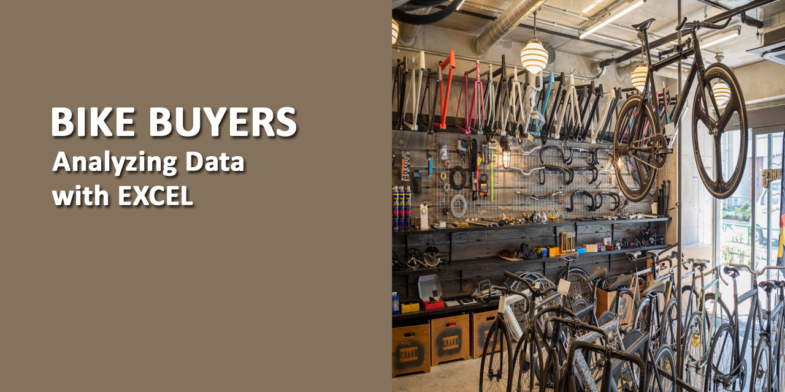

### INTRODUCTION:

The project is conducted to explore, clean and visualize Bike buyers data using **Microsoft Excel**. The study is made to find a connection, based on information provided by people that can possibly lead them to purchase bikes.

### DATASET OVERVIEW:

The data used in this study is a secondary data collected from the regions Europe, North America and Pacific. The data has been obtained from the official website of kaggle. The Excel file has been attached in my Github repository.

### DATA EXPLORATION:

The dataset contains both qualitative (nominal data) and quantitative (discrete data) variables.  It includes 13 columns and more than 1000 rows. Each person’s information is recorded in a single row. The data consists of following variables:

1.	ID : unique id of every individual 
2.	Marital status : Married or Single
3.	Gender : Male or Female
4.	Yearly Income : Specifies yearly income of an individual
5.	Children : Specifies number of children of an individual
6.	Education : Partial College, Graduate Degree, High School, Bachelors, Partial High School
7.	Occupation : Clerical, Professional, Management, Manual, Skilled Manual
8.	Home owner : It specifies whether the individual is owner of the house
9.	Cars : The number of cars individual owns
10.	Commute Distance : Distance from work place to home
11.	Region : Europe, Pacific, North America
12.	Age : Specifies age of an individual
13.	Purchased Bike : It specifies whether the individual has purchased the bike or not

The data does not comprises of information about people with their names, instead every person’s particulars are entered with their unique IDs. 

Further it has been observed that in some of the columns, ambiguous abbreviations are used which will be taken into consideration in cleaning phase. 

Before start cleaning the data, it’s always good to make a copy of the original dataset and then do working on it. So in case of any probable issue, we can always go back to our original data.

Below is the screenshot of the raw data.

<figure>
    
    <figcaption>Raw Data</figcaption>
</figure>

### DATA CLEANING:

Let’s start the data cleaning phase by giving a quick glance on the dataset by putting filter on all columns by using Filter from Data Menu. Moreover, I have copied the data in separate sheet and named it as **Working Sheet**.

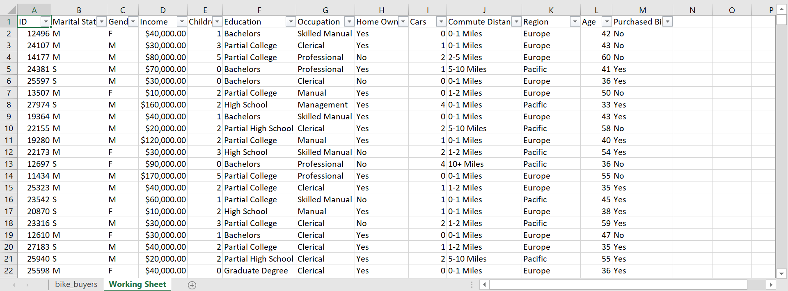

This shows all the data I am working with and then I will start cleaning it up, making it more useful for my analysis purpose.

**To check duplicates:**

Select all data > Data > Remove Duplicates > Select all columns > OK

The dataset contained 26 duplicate values which have been removed by following the above mentioned step.

**To replace ambiguous abbreviations:**

The values in second and third column of dataset are entered as abbreviations. To ensure data clarity I will replace these abbreviations with meaningful words.

Select Marital Status column > Home > Find & Select > Replace > M for Married

M for Married is replaced for 538 values.

Again Select Marital Status column > Home > Find & Select > Replace > S for Single

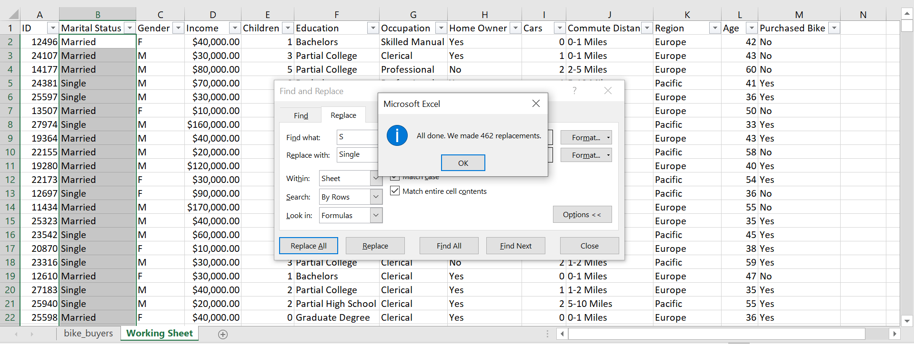

S for Single is replaced for 462 values.

Similarly I will change the values for Gender column.

Select Gender column > Home > Find & Select > Replace > F for Female

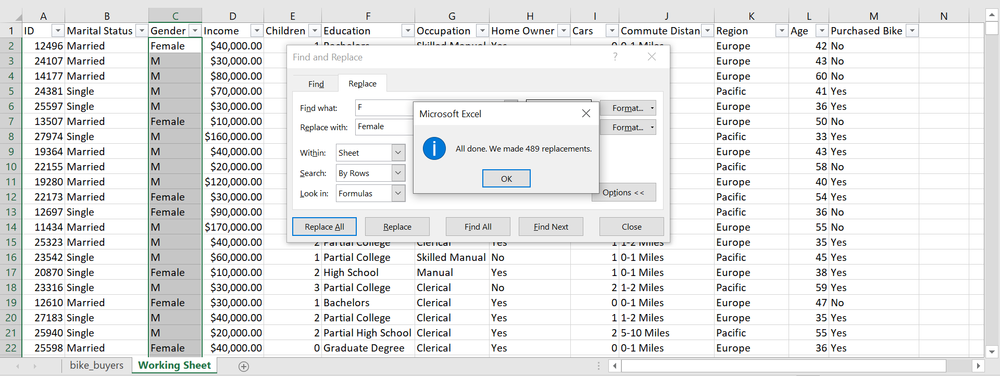

F is replaced with Female for 489 values.

Select Gender column > Home > Find & Select > Replace > M for Male

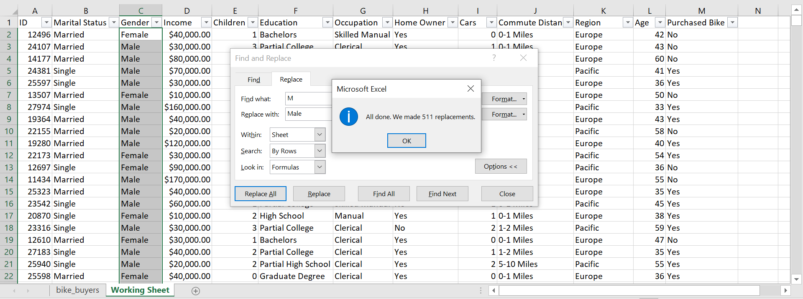

M is replaced with Male for 511 values.

**To check datatype:**

Ensure that Income is in currency format and decrease the decimal places in the entire column.

**To replace word in Commute column:**

Replace the ‘10+ Miles’ word with ‘More than 10 Miles’ in order to give a proper order to all these ranges for appearing in pivot table.

A shortcut to do this is, simply press CTRL + H on keyboard, this will open Find & Replace dialogue box.

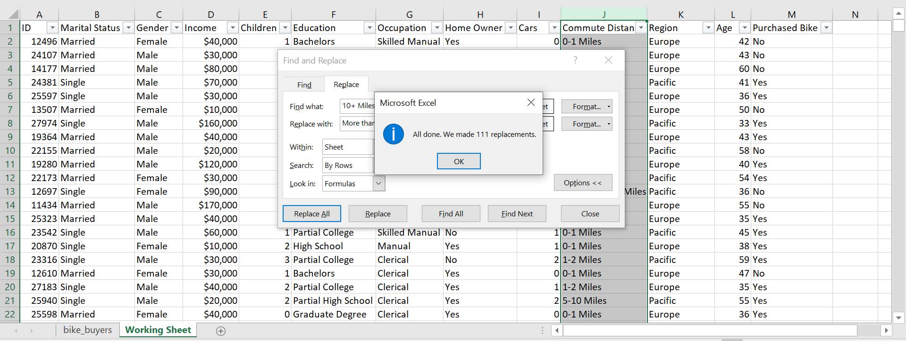

Values have been replaced as entered.

**Adding a new column Age Group:**

As the age values contains entries in specific numbers from 25 to 89, it’s better to divide the ages into three ranges. Insert a new column giving heading ‘Age Group’ and then type the following formula.

=IF(L2>54,"55-90",IF(L2>=31,"31-54",IF(L2<31,"18-30","Invalid")))

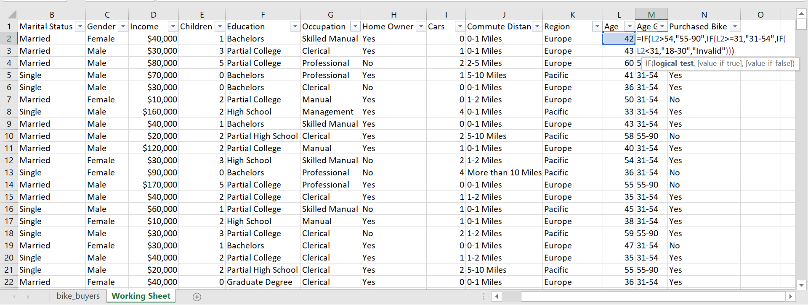

Now the data is cleaned and will move to create pivot tables and charts for visualization.

### DATA VISUALIZATION:

Before making charts, the first step will be building Pivot tables and to find what factors are involved in purchase of bikes.

**1.	To find connection between gender-wise income and purchase of bikes.**

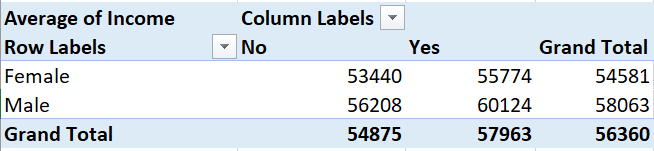

The chart will explain it better.

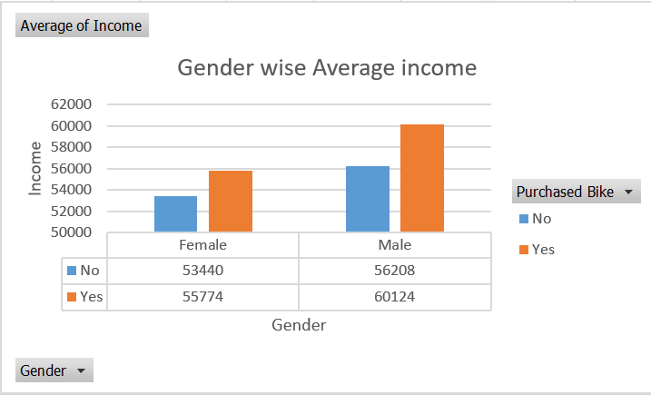

**2.	To find connection between commute distance and purchase of bikes.**

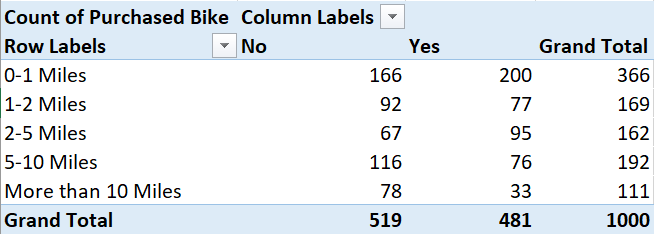

**3.	To find connection between bike purchase per age group.**

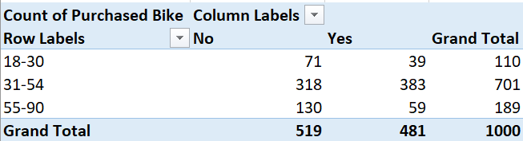

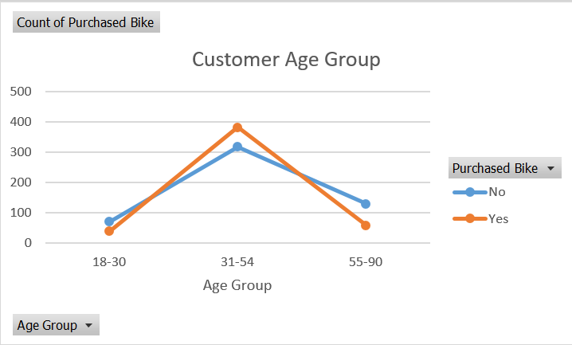

### CREATING DASHBOARD:

By using charts, I will be creating a dashboard to show a comprehensive view that will give better insights to analyze significant data in key areas.

I have also added different slicers on the left side of the dashboard to make the visualization more attractive and to observe the data on different criteria. 

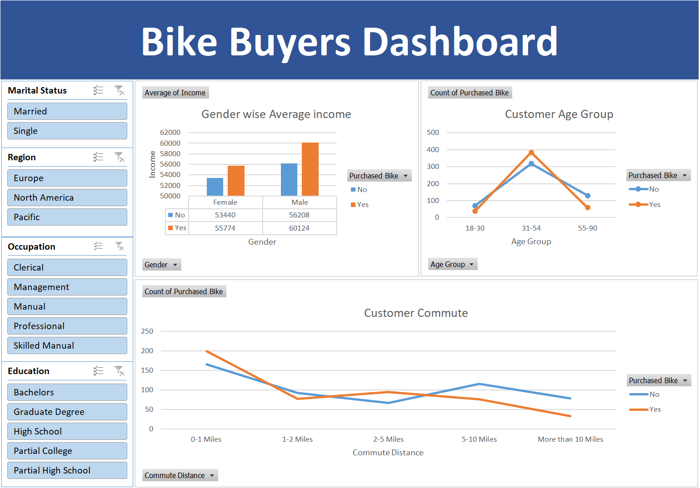

**Thank you for reading this project.**
